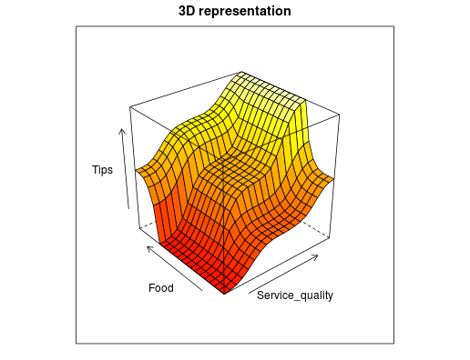

#Fuzzyfic
Fuzzy logic with ruby

##Example
```ruby
# Input 1 : Service quality
service_quality = {
	bad: Fuzzyfic::Gaussian.new([0,10], 0, 1.5), # => support=[0,10], center=0, width=1.5, using [exp(-((x-center)^2)/(2*width^2))]
	good: Fuzzyfic::Gaussian.new([0,10], 5, 1.5),
	excellent: Fuzzyfic::Gaussian.new([0,10], 10, 1.5)
}

# Input 2 : Food
food = {
	execrable: Fuzzyfic::Trapezoid.new([0,3], [0,1]),
	delicious: Fuzzyfic::Trapezoid.new([7,10], [9,10])
}

# Output : Tips
tips = {
	low: Fuzzyfic::Triangle.new([0,10], 5), # => support=[0,10], kernel/center/peak=5
	average: Fuzzyfic::Triangle.new([10,20], 15),
	high: Fuzzyfic::Triangle.new([20,30], 25)
}


# Rules
rules = []
rules.push service_quality[:bad].or(food[:execrable]).then tips[:low] # => If the service_quality is bad or the food is execrable, then the tips are low
rules.push service_quality[:good].then tips[:average]
rules.push service_quality[:excellent].or(food[:delicious]).then tips[:high]


# Apply Rules, using Centroid/COG method
Fuzzyfic::Defuzzifier.cog(rules, 6.19, 8.42)# Print 19.97 => (service_quality=6.19, food=8.42) => tips=19.97
```

<p align="center">
	
</p>